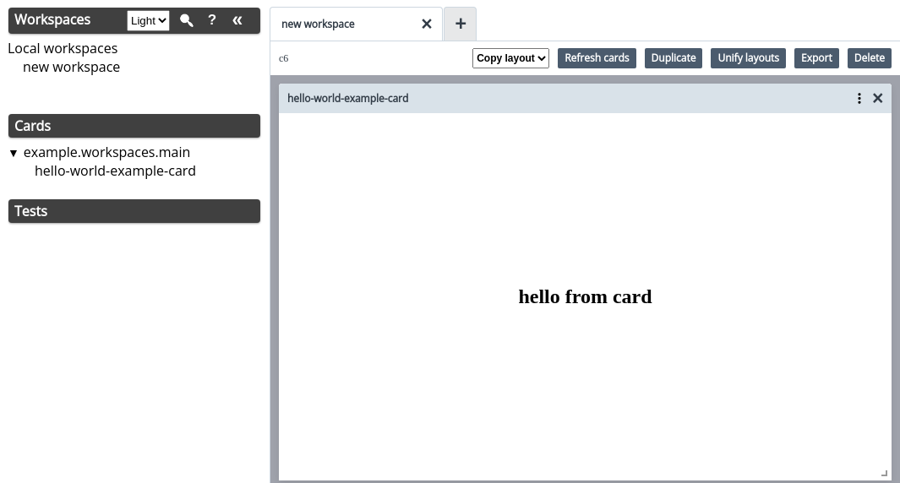

# minimal example setup using nubank/workspaces :browser target



if you have nix installed, run `nix-shell`, then `dev`, and you should get a working instance of workspaces like what's shown above

# background

as of this commit, cloning the workspaces project from https://github.com/nubank/workspaces

and running `shadow-cljs watch workspaces` does not reliably work:

```
$ shadow-cljs watch workspaces
shadow-cljs - config: /tmp/workspaces/shadow-cljs.edn
shadow-cljs - starting via "clojure"
Executable 'clojure' not found on system path.
$ which clojure
clojure not found
```

that looks sensible, but:

```
$ nix-shell -p clojure
$ which clojure
/nix/store/j1x2xyglp47g1dlfr44rjh3vd87rjs7q-clojure-1.10.3.1087/bin/clojure
$ shadow-cljs watch workspaces
shadow-cljs - config: /tmp/workspaces/shadow-cljs.edn
shadow-cljs - starting via "clojure"
WARNING: Implicit use of clojure.main with options is deprecated, use -M
Exception in thread "main" java.lang.RuntimeException: Unable to resolve symbol: requiring-resolve in this context, compiling:(shadow/cljs/devtools/cli.clj:70:16)
... stacktrace ...
```

another approach is to set up a minimal project and include nubank/workspaces, one that looks like this one.

it turns out if we initialize the repository with e.g. `yarn add shadow-cljs`, it will fetch the latest version available.

this leads to this compilation message and an unusable workspaces:

```
shadow-cljs - config: /tmp/demodemodemodemo/cljs-minimal-nubank-workspaces-example/shadow-cljs.edn
[2022-05-06 00:17:42.648 - WARNING] TCP Port 9630 in use.
shadow-cljs - HTTP server available at http://localhost:8080
shadow-cljs - server version: 2.18.0 running at http://localhost:9631
shadow-cljs - nREPL server started on port 35671
shadow-cljs - watching build :workspaces
[:workspaces] Configuring build.
[:workspaces] Compiling ...
[:workspaces] Build failure:
The required namespace "goog.debug.Logger.Level" is not available, it was required by "fulcro/logging.cljc".
```

this issue is in discussion at https://github.com/nubank/workspaces/issues/65

backtracking on the shadow-cljs versions reveals that at present, the most
recent version that compiles successfully, and yields a working workspaces, is
`2.15.12`, so its version is locked in the package.json file here. this issue
is likely related to the google closure compiler discussed at
https://github.com/thheller/shadow-cljs/issues/980
